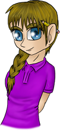

# Me-On-The-Computer
<!doctype html>
<html><!-- InstanceBegin template="/Templates/WebProjectTemp.dwt" codeOutsideHTMLIsLocked="false" -->
<head>
<meta charset="utf-8">
<!-- InstanceBeginEditable name="doctitle" -->
<meta http-equiv="X-UA-Compatible" content="IE=edge">
<meta name="viewport" content="width=device-width, initial-scale=1.0">
<title>Me On The Computer - Artistic Services</title>
<!-- InstanceEndEditable -->
<!-- InstanceBeginEditable name="head" -->
<!-- InstanceEndEditable -->
<link href="file:///C|/Users/Owner/AppData/Roaming/Adobe/Dreamweaver CC 2017/en_US/Configuration/Temp/Assets/eamBFAB.tmp/css/bootstrap.css" rel="stylesheet" type="text/css">
<link href="CSS/WebTemplate.css" rel="stylesheet" type="text/css">
<!-- HTML5 shim and Respond.js for IE8 support of HTML5 elements and media queries -->
<!-- WARNING: Respond.js doesn't work if you view the page via file:// -->
<!--[if lt IE 9]>

<![endif]-->
<!--The following script tag downloads a font from the Adobe Edge Web Fonts server for use within the web page. We recommend that you do not modify it.-->

</head>

<body style="padding-top: 70px">

<nav class="navbar navbar-default">
  

    <!-- Brand and toggle get grouped for better mobile display -->
    

      

    <!-- Collect the nav links, forms, and other content for toggling -->
    

      <ul class="nav navbar-nav navbar-right">
        <li><a href="MOTC_Mashup.html">Classic Pop Mashups</a></li>
        <li><a href="MOTC_Charcoal.html">Charcoal Works</a></li>
        <li><a href="MOTC_Color.html">Colorized Charcoal Drawings</a></li>
        <li><a href="MOTC_Personal.html">Personal Works</a></li>
        <li><a href="MOTC_Video.html">Animations</a></li>
        <li><a href="MOTC_Specs.html">Price Specs</a></li>
        <li><a href="MOTC_Contact.html">Contact Me!</a></li>
      </ul>
    

    <!-- /.navbar-collapse -->
  

  <!-- /.container-fluid -->
</nav>

  

    <aside><h4>The Story of MOTC</h4>
    
Me On The Computer--or MOTC for short--originally started off as a sort of gag that I would include on the back of cards I made for people. Whether it was a good luck card, a birthday card, or a get well card, you could always expect to find a little stick figure seated at an old computer on the back. Eventually after I graduated high school, Me On The Computer evolved into a private business. I collaborate with different printing companies for bring you products such as canvas prints, greeting cards for all occasions, and even custom printed gifts like coffee mugs and pillows. My chosen works can be viewed in my various galleries. Take a look!

    </aside>
  

  <!-- InstanceBeginEditable name="EditRegion3" -->
  

    <h1>Welcome To My Unofficial Business Site!</h1>
    <article>
I'm an independent artist who creates work using a variety of media, from charcoal and pens to digital art programs such as Photoshop and Illustrator. I also create animations and personal work in my spare time.

    
Most of my work incorperates humor in some way, but there is also work that shows how I view many things in the world, many of my canvas paintings and charocal drawings captivate the <strong>wonder</strong> in the world, whereas my animations and personal works show that there can be both <strong>fun times</strong> and <strong>serious times</strong>.

    
I draw inspiration (no pun intended...) from various artists of different eras, styles, and occupations. As my various galleries showcased on this site will show. From Vincent Van Gogh, to Georgia O'Keefe, to Norman Rockwell, even Japanese Pop Culture and various personal interests, such as video games, movies, TV shows, and comics! (<em>PSST!</em> Look in my personal works for works based on what I'm into!)

    
I hope you can see the wonder in the world through my eyes in my various works! As well as the trials life has thrown at me!

     </article>
    
  

  <!-- InstanceEndEditable -->

<footer>Me On The Computer 2017</footer>
</body>
<!-- InstanceEnd --></html>
